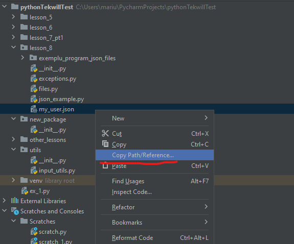
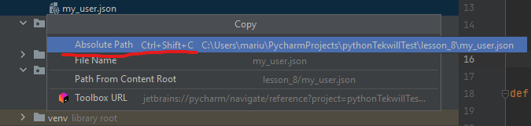
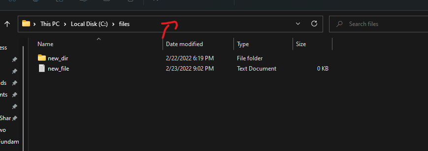
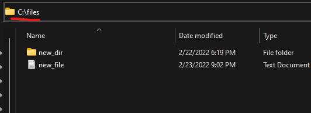

# Homework note 1:

As you have seen, **open()** works with files that are in the same folder as the .py file.

When you want to read files using **open()** you should either provide the name of the file: example _my_file.txt_ (for
a file that is in the same folder as the .py file you are executing)

```python
file = open('my_file.txt')
```

Or you can provide the full path to file: example _'C:\\files\\new_file.txt'_ Use backslash \ to escape the backlash in
the file path.

````python
file = open('C:\\files\\new_file.txt')  # Change your path accordingly
````

### How to get the path of a file ?

#### In pycharm



Then



#### In windows



Then



This will give you the path to the folder.

Add \new_file.txt to it, and you have your full file path.

In my example it's C:\\files\\new_file.txt

# Exercises

## Exercise 1

Create a python program that will create a file with the name input from console.

### RO:

Create o programa python care va crea un fisier conform unui nume (sau path) introdus de la consola.

## Exercise 2

Create a python program that will open the file _ex_2_file.txt_ [find it here](files/ex_2_file.txt) and print out it's
content.


### RO:

Create o programa python care deschide fiserul _ex_2_file.txt_ [gasit aici](files/ex_2_file.txt) si va afisa ce contine fisierul.

## Exercise 3

Create a python program that will read the **name** of a file from the console.

Then, create a file with the **file name** input from the console. Then ask the user to type any text.

The text input by the user should be then added to the file.

Then print the text input by the user from the file.


### RO:

Creati un program python care va citi numele unui fisier de la consola.

Programul va crea un fisierl cu numele fisierului citit de la consola, apoi va intreba utilizatorul sa scrie un text.

Textul introdus de utilizator trebuie adaugat in fisier.

Apoi cititi din fisier textul introdus de utilizator.

## Exercise 4

Create a program where the user has 2 options.

* List all dishes
    * Prints out all dishes from a file
* Add dish
    * Adds a dish and saves it to the file

The program should save the list of dishes to a file. (Use JSON to store the information inside the file)

If the user closes the program and opens it again. List all dishes should print out the previously saved list of dishes.


### RO:

Creati un program care va avea 2 optiuni:
 
* Afiseaza toate bucatele
  * Va afisa toate bucatele stocate intr-un fisier
* Adauga bucata
  * Va adauga o bucata in lista din fisier

Daca utilizatorul re-porneste programul, la afisarea bucatelor, trebuie sa fie afisate toate elementele salvate anterior.

## Exercise 5

Create a Python program that takes a text file name (or path) as input and prints out the line in the text file that has
the highest number of words.

Use this file [file](files/large_text_file.txt)


### RO

Creati un program care va citi un fisier textual conform unui path, din input. 

Programul va afisa linia din text care are cea mai mare lungime.

## Exercise 6

Given the following .json [file](files/employee_list.json).

_Note: salary value is amount per month_

Create a program that will:

* List all employee names
* List all position names
* Calculate the amount of salary the company has to pay per month in total
* Calculate the amount of money the company has to pay in taxes per month. (Tax % Value is input from the console)
* Display information for the top 10 highest paid employees (name, position, salary, employment_start_date) from highest
  paid to lower.
* Display information for the top 10 employees with the longest time in the company (name, position, salary,
  employment_start_date) from highest to lower.

### RO

Avand urmatorul fisier JSON: [file](files/employee_list.json).

Creati un program care va afisa urmatoare informatie din fisier.

* Lista de toti lucratorii
* Lista la toate pozitiile din companie (Unicale)
* Calculeaza suma totala care compania are de achitat lucratorii
* Calculeaza suma totala de impozite care compania are de achitat intr-o luna
  * Valoarea de % impozit e introdusa la consola
* Afiseaza informatie despre 10 cei mai bine platiti lucratori ((name, position, salary, employment_start_date) de la mai mult la mai putin.
* Afiseaza informatie despre 10 lucratori cu cel mai mult timp in companie (name, position, salary,
  employment_start_date) de la mare la mic. 
